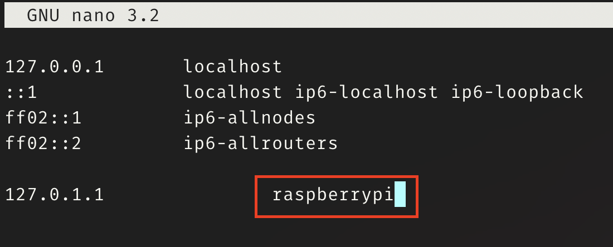

# RPi-Cheatsheet

A cheat sheet for imaging and configuring a raspberry pi.

## Imaging

Imaging the pi can be done with the **Raspberry Pi Imager** that can be found at this link:

- https://www.raspberrypi.com/software/

## Setting up SSH and Wifi

If you're using Raspberry Pi OS, the pi can be configured to use SSH and Wifi before the first bootup.  This allows "headless" operation.

Create a blank text file called `ssh` without any file extension and place it in the root of the boot drive you just imaged.

If you want the pi to access your Wifi, you can create a file called `wpa_supplicant.conf` and place it in the root of the boot drive. Contents of the file should be as follows:

```
ctrl_interface=DIR=/var/run/wpa_supplicant GROUP=netdev
update_config=1
country=US

network={
 ssid="Network Name Here"
 psk="Network Password Here"
}
```

**Note:** Make sure to leave the quote marks for your `ssid` and `psk`.

Also, if your country isn't the US, you will have to change the [country code](https://en.wikipedia.org/wiki/List_of_ISO_3166_country_codes).

Demo versions of the files can be found in this repository in the [access_files](./access_files) directory.

## Logging In

The default login credentials for Raspberry Pi OS are:

- **User:** pi
- **Password:** raspberry

The following command will allow you to SSH into the pi:

```
ssh pi@raspberrypi.local
```

## Change Password

Change your password with this command:

```
passwd
```

## Create New User

Create new user with this command:

```
sudo adduser <NewUser>
```

Add new user to `sudo` group for admin access:

```
sudo adduser <NewUser> sudo
```

**Note:** Replace `<NewUser>` with desired user name.

## Change Hostname

Open `/etc/hostname` in the nano editor:

```
sudo nano /etc/hostname
```

Change the name in the file to the desired hostname, then hit CTRL+X.

Open `/etc/hosts` in the nano editor:

```
sudo nano /etc/hosts
```



Change the name in the `127.0.1.1` line to the desired hostname, then hit CTRL+X.

**Note:** Both files should be changed and then hostnames should match.

A restart will be required for changes to take place.

## Other Useful Commands

| Command | Description |
| ----------- | ----------- |
| `sudo apt update` | Returns list of packages that can be updated |
| `sudo apt upgrade` | Upgrades packages to latest version |
| `sudo reboot` | Reboots system immediately |
| `sudo shutdown -h now`| Shuts down the system immediately |
| `sudo !!` | Repeats the last command but adds `sudo` to the beginning |
| `ifconfig` | Returns network information for the device |

## Documents Referenced

- [17 Security Tips for your Raspberry Pi](https://raspberrytips.com/security-tips-raspberry-pi/)
- [How to Change Raspberry Pi Hostname](https://blog.jongallant.com/2017/11/raspberrypi-change-hostname/)
- [Headless Raspberry Pi 3 B+ SSH WiFi Setup](https://desertbot.io/blog/headless-raspberry-pi-3-bplus-ssh-wifi-setup)